# NYC Taxi AI Dashboard

An AI-powered analytics dashboard built on NYC TLC taxi data (2019–present), featuring real-time aggregations, ML model predictions, and interactive visualizations.

---

## Stack

| Layer        | Technology                        |
|--------------|-----------------------------------|
| Ingestion    | Python + Requests                 |
| Processing   | PySpark (local mode)              |
| ML           | Spark MLlib                       |
| Broker       | RabbitMQ                          |
| Cache        | Redis                             |
| Database     | PostgreSQL                        |
| Backend      | FastAPI                           |
| Frontend     | Plotly Dash                       |
| Infra        | Docker Compose                    |

---

## Data Sources

NYC TLC Trip Record Data (Parquet), published monthly with ~3 month delay:

- Yellow Taxi (2019–present)
- Green Taxi (2019–present)
- FHV / For-Hire Vehicles (2019–present)
- FHVHV / High Volume FHV — Uber, Lyft (2019–present)

Source: `https://d37ci6vzurychx.cloudfront.net/trip-data/`

---

## Architecture



### RabbitMQ Queues & Exchanges

| Name | Type | Published by | Consumed by |
| --- | --- | --- | --- |
| `etl.extracted` | queue | Extract | Transform |
| `etl.transformed` | queue | Transform | Load |
| `etl.loaded` | fanout exchange | Load | All 4 model services |

### Redis Usage

Each model service writes its status to Redis upon completing training:

```bash
model:fare:status     = "ready"
model:demand:status   = "ready"
model:tip:status      = "ready"
model:anomaly:status  = "ready"
```

FastAPI checks these keys before serving predictions — if a key is missing or not `"ready"`, it returns a "model not ready" response.

### Data Volumes

```bash
/data/raw/{taxi_type}/{year}/*.parquet        ← Extract writes here
/data/processed/zone_hourly/{taxi_type}/      ← Transform writes here
/data/processed/daily_stats/{taxi_type}/
/data/processed/zone_time_buckets/{taxi_type}/
/data/processed/zone_anomaly_stats/{taxi_type}/
/data/models/fare/                            ← Model services write here
/data/models/demand/
/data/models/tip/
/data/models/anomaly/
```

---

## Services

### ✅ Extract (`ETL/extract/`)

- Downloads raw Parquet files from TLC CDN
- Skips already-downloaded files (diff against local disk)
- Runs on startup then schedules monthly refresh on the 15th at 02:00 UTC
- Publishes `{ event, path, action }` to `etl.extracted`

**Known improvements:**

- Cutoff should be 3 months back to avoid 403s on unpublished data
- `START_DATE` currently set to 2025 for testing — change back to 2019 for production

---

### ✅ Transform (`ETL/transform/`)

- Listens on `etl.extracted` queue
- Skips processing if `action: no-op`
- Normalises column names across all 4 taxi types to a unified schema
- Cleans data (filters bad rows, durations, fares)
- Engineers time features (hour, day of week, month, time bucket, is_weekend)
- Produces 4 aggregated Parquet datasets:
  - `zone_hourly` — trip count + averages per zone per hour (feeds map + demand forecast)
  - `daily_stats` — daily summary per taxi type (feeds KPI cards)
  - `zone_time_buckets` — trip count per zone per time of day (feeds clustering)
  - `zone_anomaly_stats` — mean + stddev per zone (feeds anomaly detection)
- Publishes `{ event, path }` to `etl.transformed`

**Known improvements:**

- Should process only new files (passed via RabbitMQ message) rather than reprocessing everything
- Should write partitioned output per month to enable incremental loading

---

### 🔲 Load (`ETL/load/`)

- Listens on `etl.transformed` queue
- Reads aggregated Parquet files from `/data/processed`
- Writes to PostgreSQL
- Publishes to `etl.loaded` fanout exchange to trigger all model services

---

### 🔲 FarePrediction (`models/fare/`)

- Subscribes to `etl.loaded` fanout exchange
- Trains GBTRegressor on: pickup zone, dropoff zone, time of day, day of week
- Saves model artifact to `/data/models/fare/`
- Sets `model:fare:status = "ready"` in Redis

---

### 🔲 DemandForecast (`models/demand/`)

- Subscribes to `etl.loaded` fanout exchange
- Trains regression model on: zone, hour, day of week, month
- Saves model artifact to `/data/models/demand/`
- Sets `model:demand:status = "ready"` in Redis

---

### 🔲 TipPrediction (`models/tip/`)

- Subscribes to `etl.loaded` fanout exchange
- Trains classifier on: fare, zone, time, payment type (yellow/green only)
- Saves model artifact to `/data/models/tip/`
- Sets `model:tip:status = "ready"` in Redis

---

### 🔲 AnomalyDetection (`models/anomaly/`)

- Subscribes to `etl.loaded` fanout exchange
- Trains KMeans clustering model, flags trips far from cluster centers
- Saves model artifact to `/data/models/anomaly/`
- Sets `model:anomaly:status = "ready"` in Redis

---

### 🔲 FastAPI (`api/`)

- Checks Redis for model readiness before serving predictions
- Planned endpoints:
  - `GET /stats/zones` — zone-level hourly stats
  - `GET /stats/daily` — daily KPI data
  - `POST /predict/fare` — fare prediction
  - `POST /predict/demand` — demand forecast
  - `POST /predict/tip` — tip prediction
  - `GET /anomalies` — flagged anomalous trips

---

### 🔲 Dash Frontend (`dashboard/`)

- Map view — pickup heatmap per zone
- KPI cards — total trips, revenue, average fare per day
- Demand forecast chart — predicted vs actual trips per zone
- Fare predictor — user inputs zone + time, gets predicted fare
- Anomaly explorer — flagged trips with drill-down
- Clustering view — zone hotspots by time of day

---

## Getting Started

```bash
# Run full stack
docker-compose up --build

# Check downloaded files
docker exec extract-service find /data/raw -name "*.parquet"

# Check processed data
docker exec transform-service find /data/processed -name "*.parquet"

# RabbitMQ management UI
open http://localhost:15672   # guest / guest
```

---

## Known Issues & Planned Improvements

- [ ] Transform: process only new files, not full reprocess every run
- [ ] Transform: partition output by month for incremental loading
- [ ] Extract: cutoff should be 3 months back (currently causes 403s on latest 2 months)
- [ ] Extract: revert `START_DATE` to 2019 for production
