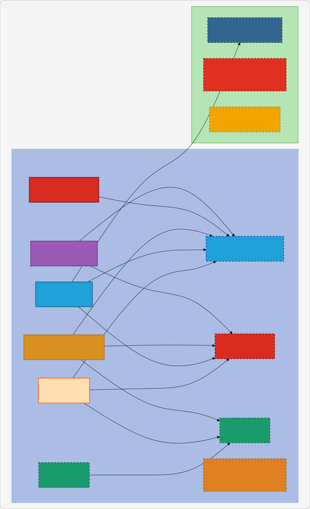

# NYC Taxi AI Dashboard

[](https://github.com/mbofos01/nyc-taxi-dashboard/actions)

An AI-powered analytics dashboard built on NYC TLC taxi data (2019–present), featuring real-time aggregations, ML model predictions, and interactive visualizations.

---

## Stack

| Layer         | Technology                         |
|---------------|------------------------------------|
| Ingestion     | Python + Requests                  |
| Processing    | PySpark (standalone cluster)       |
| ML            | Spark MLlib                        |
| Broker        | RabbitMQ                           |
| Cache / State | Redis                              |
| Database      | PostgreSQL                         |
| Monitoring    | Prometheus + Grafana + Pushgateway |
| ETL Control   | FastAPI                            |
| Backend API   | FastAPI *(planned)*                |
| Frontend      | Plotly Dash *(planned)*            |
| Infra         | Docker Compose                     |

---

## Data Sources

NYC TLC Trip Record Data (Parquet), published monthly with ~3 month delay:

- Yellow Taxi (2019–present)
- Green Taxi (2019–present)
- FHV / For-Hire Vehicles (2019–present)
- FHVHV / High Volume FHV — Uber, Lyft (2019–present)

Source: `https://d37ci6vzurychx.cloudfront.net/trip-data/`

---

## Architecture



### RabbitMQ Queues & Exchanges

| Name | Type | Published by | Consumed by |
| --- | --- | --- | --- |
| `etl.cmd.extract` | queue | ETL Control API | Extract |
| `etl.extracted` | queue | Extract, ETL Control API | Transform |
| `etl.transformed` | queue | Transform, ETL Control API | Load |
| `etl.loaded` | fanout exchange | Load, ETL Control API | All model services |

All queues and the fanout exchange are durable — messages survive broker restarts and consumer downtime.

### Redis Keys

```bash
# SET — filenames already transformed; prevents reprocessing on restart or duplicate messages
{REDIS_TRACKING_ROOT}:{REDIS_PROCESSED_SET}      → SADD / SISMEMBER   (Transform writes)

# STRING "0"/"1" — gates the message-triggered load path
# Transform sets to "1" after completing; Load reads and resets to "0" after loading
{REDIS_TRACKING_ROOT}:{REDIS_LOADED_FLAG}        → SET / GET          (Transform writes, Load reads)

# STRING "0"/"1" — crash-safety dirty flag per taxi type
# "0" = run in progress (or crashed); "1" = last run completed cleanly
{REDIS_TRACKING_ROOT}:{taxi_type}                → SET / GET          (Transform writes)

# HASH field="{dataset}/{taxi_type}", value=float mtime
# Tracks the mtime of each processed dir at last successful load
{REDIS_TRACKING_ROOT}:{REDIS_LOADED_DIRS_HASH}   → HSET / HGET        (Load cron writes)

# STRING "training"/"ready"/"failed" — model training status
{REDIS_MODEL_ROOT}:{REDIS_FARE_MODEL_KEY}:status → SET / GET          (FarePrediction writes)
```

### Data Volumes

```bash
/data/raw/{taxi_type}_tripdata_{year}-{month}.parquet   ← Extract writes here
/data/processed/zone_hourly/{taxi_type}/                ← Transform writes here
/data/processed/daily_stats/{taxi_type}/
/data/processed/zone_time_buckets/{taxi_type}/
/data/processed/zone_anomaly_stats/{taxi_type}/
/data/models/fare/                                      ← Model services write here
/data/models/demand/
/data/models/tip/
/data/models/anomaly/
```

---

## Services

### ✅ Nginx (`nginx/`)

Reverse proxy service routing external requests to internal services under sub-paths:

- `/health` — health check endpoint returning "ok"
- `/etl-api/` — proxies to ETL Control API (FastAPI)
- `/spark/` — proxies to Spark Master UI with URL rewriting for assets
- `/grafana/` — proxies to Grafana dashboards
- `/prometheus/` — proxies to Prometheus metrics
- `/pushgateway/` — proxies to Prometheus Pushgateway with URL rewriting
- `/rabbitmq/` — proxies to RabbitMQ Management UI

Configuration uses environment variable substitution at container startup. WebSocket support enabled for Grafana Live.

---

### ✅ ETL Control API (`ETL/api/`)

FastAPI service providing HTTP control over the entire pipeline. Interactive docs at `http://localhost:{API_PORT}/redoc`.

**Trigger endpoints** (`POST`) — publish messages to RabbitMQ to start pipeline stages on demand:

- `/etl/extract` — sends a run command to `etl.cmd.extract`
- `/etl/transform` — publishes to `etl.extracted`
- `/etl/load` — publishes to `etl.transformed`
- `/etl/models` — broadcasts to the `etl.loaded` fanout exchange

**Invalidation endpoints** (`DELETE`) — clear Redis state and optionally delete data files:

- `/invalidate/extract` — deletes `processed_files` set + clears `RAW_DATA_DIR`
- `/invalidate/transform` — deletes `processed_files` set + clears `PROCESSED_DATA_DIR`
- `/invalidate/load` — deletes `loaded_dirs` hash + sets `loaded_flag="1"`
- `/invalidate/pipeline` — nuclear reset: all of the above combined

**Flag endpoints** — manually toggle load gating without touching data:

- `POST /redis/invalidate/load` — sets `loaded_flag="0"` + deletes `loaded_dirs` hash
- `POST /redis/validate/load` — sets `loaded_flag="1"` + deletes `loaded_dirs` hash

**Data deletion:** `DELETE /data/raw` — deletes all files under `RAW_DATA_DIR`

---

### ✅ Extract (`ETL/extract/`)

- On startup: runs `run_extraction()` immediately to catch up on missing files
- Listens on `etl.cmd.extract` queue (daemon thread) for on-demand run commands from the ETL Control API
- Monthly cron (configurable via `EXTRACT_CRON_DAY` / `EXTRACT_CRON_HOUR`, defaults to day 15 at 02:00 UTC) owns the main thread
- For each run: scans existing files against the expected date range; deletes and requeues corrupt files; downloads all missing files
- Validates each file's Parquet magic bytes (`PAR1`); retries once on corruption, marks as `DOWNLOAD_FAILED` if retry also corrupt
- End date automatically set to 3 months ago to avoid 403s on unreleased data
- Publishes `{ event, triggered_by, summary, timestamp }` to `etl.extracted`
- Pushes Prometheus metrics to Pushgateway (`job=etl_extract`): files downloaded/skipped/not-found/failed, per-file sizes, total disk bytes, outcome durations

---

### ✅ Transform (`ETL/transform/`)

- Consumes messages from `etl.extracted` queue; on each message calls `find_pending_files()` — if nothing is pending, pushes a noop heartbeat metric and acks without starting Spark
- Daily cron (configurable via `TRANSFORM_CRON_HOUR` / `TRANSFORM_CRON_MINUTE`) also calls `find_pending_files()` and processes any backlog
- `find_pending_files()`: scans `RAW_DATA_DIR` for `*.parquet` files and filters out names already in the `{REDIS_TRACKING_ROOT}:{REDIS_PROCESSED_SET}` Redis SET
- Validates Parquet magic bytes (`PAR1`) before passing files to Spark; skips corrupt files
- Normalises column names across all 4 taxi types to a unified schema
- Date-validates each file against its filename (e.g. `yellow_tripdata_2022-01.parquet` → keeps only rows where pickup year=2022, month=01)
- Cleans data: null guards on required columns, year range (2019–present), trip duration (0–300 min), distance (0–200 mi), fare (0–$1000)
- Engineers time features: `pickup_hour`, `pickup_dow`, `pickup_month`, `pickup_year`, `pickup_date`, `is_weekend`, `time_bucket` (morning/afternoon/evening/night)
- Produces 4 aggregated Parquet datasets per taxi type:
  - `zone_hourly` — trip count + averages per zone per hour
  - `daily_stats` — daily summary per taxi type
  - `zone_time_buckets` — trip count per zone per time bucket
  - `zone_anomaly_stats` — mean + stddev per zone (fare, duration, distance)
- **Crash-safe incremental writes**: reads dirty flag (`{REDIS_TRACKING_ROOT}:{taxi_type}`) before the run; merges with existing output if `"1"` (previous run clean); overwrites if `"0"` or missing (crash detected); uses write-to-tmp-then-rename to avoid Spark reading and writing the same path
- **Redis file tracking**: marks each file in the processed SET only after all 4 writes succeed
- After all taxi types are processed: sets `{REDIS_TRACKING_ROOT}:{REDIS_LOADED_FLAG} = "1"` to signal the load service
- Pushes Prometheus metrics to Pushgateway (`job=etl_transform`): files processed, corrupt files, rows before/after cleaning, processing duration per taxi type

---

### ✅ Load (`ETL/load/`)

Dual-trigger design — two independent paths ensure no data is missed:

**Message-triggered path:**

- Consumes messages from `etl.transformed` queue
- Checks `{REDIS_TRACKING_ROOT}:{REDIS_LOADED_FLAG}` — if `"0"`, pushes a noop heartbeat and skips; if `"1"`, runs `run_load()`, resets flag to `"0"`, then publishes to `etl.loaded`
- On startup: checks if flag is `"1"` (set by a Transform run while Load was down) and runs load immediately if so

**Cron-triggered path:**

- Runs on a configurable schedule (`LOAD_CRON_HOUR` / `LOAD_CRON_MINUTE`)
- Calls `find_pending_dirs()`: checks each `{dataset}/{taxi_type}` subdirectory against the `{REDIS_TRACKING_ROOT}:{REDIS_LOADED_DIRS_HASH}` Redis hash (field = `"{dataset}/{taxi_type}"`, value = last-loaded mtime); loads only directories modified since their last load
- After loading, marks each directory via `hset` with its current mtime

**Startup self-heal:** type-checks `{REDIS_TRACKING_ROOT}:{REDIS_LOADED_DIRS_HASH}` on startup; deletes it if it holds the wrong Redis type (prevents `WRONGTYPE` errors after a pipeline reset)

**Common behaviour:**

- `run_load()` iterates the hardcoded `DATASETS` dict (`zone_hourly`, `daily_stats`, `zone_time_buckets`, `zone_anomaly_stats`), discovers taxi type subdirectories dynamically, reads all parquet part-files with `pandas`, deduplicates on primary key columns
- Upserts into PostgreSQL using `ON CONFLICT ({pk_cols}) DO UPDATE SET ...`; creates tables if they don't exist
- Publishes `{ event: "data_loaded", triggered_by, summary, timestamp }` to `etl.loaded` fanout exchange
- Pushes Prometheus metrics to Pushgateway (`job=etl_load`): rows loaded per dataset/taxi_type, duration, failure count, last success timestamp

---

### 🔲 FarePrediction (`models/fare/`)

- Binds `model.fare.train` queue to the `etl.loaded` fanout exchange; receives load events
- Training pipeline is implemented but `run_training()` is currently commented out in `on_message` — service receives messages but does not yet train
- Planned training: Spark ML `LinearRegression` on `zone_hourly` data; features: `pickup_location_id`, `pickup_hour`, `pickup_dow`, `pickup_month`, `taxi_type` (StringIndexer → StandardScaler); 80/20 train/test split; evaluates RMSE and MAE
- Saves Spark ML pipeline model to `{MODELS_DIR}/fare/` using `write().overwrite().save()`
- Sets `{REDIS_MODEL_ROOT}:{REDIS_FARE_MODEL_KEY}:status` to `"training"` → `"ready"` / `"failed"`
- Pushes Prometheus metrics to Pushgateway (`job=model_fare`): training duration, RMSE, MAE, training rows, last-trained timestamp

---

### 🔲 DemandForecast (`models/demand/`)

- Subscribes to `etl.loaded` fanout exchange
- Trains regression model on: zone, hour, day of week, month
- Saves model artifact to `/data/models/demand/`
- Sets `model:demand:status = "ready"` in Redis

---

### 🔲 TipPrediction (`models/tip/`)

- Subscribes to `etl.loaded` fanout exchange
- Trains classifier on: fare, zone, time, payment type (yellow/green only)
- Saves model artifact to `/data/models/tip/`
- Sets `model:tip:status = "ready"` in Redis

---

### 🔲 AnomalyDetection (`models/anomaly/`)

- Subscribes to `etl.loaded` fanout exchange
- Trains KMeans clustering model, flags trips far from cluster centers
- Saves model artifact to `/data/models/anomaly/`
- Sets `model:anomaly:status = "ready"` in Redis

---

### 🔲 FastAPI (`api/`)

- Checks Redis for model readiness before serving predictions
- Planned endpoints:
  - `GET /stats/zones` — zone-level hourly stats
  - `GET /stats/daily` — daily KPI data
  - `POST /predict/fare` — fare prediction
  - `POST /predict/demand` — demand forecast
  - `POST /predict/tip` — tip prediction
  - `GET /anomalies` — flagged anomalous trips

---

### 🔲 Dash Frontend (`dashboard/`)

- Map view — pickup heatmap per zone
- KPI cards — total trips, revenue, average fare per day
- Demand forecast chart — predicted vs actual trips per zone
- Fare predictor — user inputs zone + time, gets predicted fare
- Anomaly explorer — flagged trips with drill-down
- Clustering view — zone hotspots by time of day

---

## Environment Variables

All services are configured via a `.env` file in the project root. Create one by copying the template below:

```dotenv
# ── Extract: source & HTTP ─────────────────────────────────────────────────
TLC_BASE_URL="https://d37ci6vzurychx.cloudfront.net/trip-data"
SERVER_TIMEOUT=15 # seconds

# ── Extract: start date ────────────────────────────────────────────────────
START_YEAR=2025
START_MONTH=9
START_DAY=1

# ── Scheduler: extract (monthly) ──────────────────────────────────────────
EXTRACT_CRON_DAY=15
EXTRACT_CRON_HOUR=3

# ── Scheduler: transform (daily) ──────────────────────────────────────────
TRANSFORM_CRON_HOUR=2
TRANSFORM_CRON_MINUTE=10

# ── Scheduler: load (daily) ───────────────────────────────────────────────
LOAD_CRON_HOUR=3
LOAD_CRON_MINUTE=30

# ── RabbitMQ ──────────────────────────────────────────────────────────────
RABBITMQ_HOST=rabbitmq
RABBITMQ_PORT=5672
RABBITMQ_DEFAULT_USER=guest
RABBITMQ_DEFAULT_PASS=guest
RABBITMQ_USER=guest
RABBITMQ_PASSWORD=guest
RABBITMQ_E_QUEUE=etl.extracted
RABBITMQ_T_QUEUE=etl.transformed
RABBITMQ_L_EXCHANGE=etl.loaded
RABBITMQ_CMD_EXTRACT=etl.cmd.extract
RABBITMQ_LOGS="/dev/null"
RABBITMQ_LOG_LEVEL="none"

# ── Data directories ───────────────────────────────────────────────────────
RAW_DATA_DIR="/data/raw"
PROCESSED_DATA_DIR="/data/processed"
MODELS_DIR="/data/models"
LOG_DIR="logs"

# ── Spark ──────────────────────────────────────────────────────────────────
SPARK_MASTER_URL=spark://spark-master:7077
SPARK_MASTER_PORT=7077
SPARK_WORKER_MEMORY=4g
SPARK_WORKER_CORES=2

# ── Nginx ─────────────────────────────────────────────────────────────────
NGINX_PORT=80
NGINX_HOST=localhost
GRAFANA_HOST=grafana
GRAFANA_PORT=3000
PROMETHEUS_HOST=prometheus
PROMETHEUS_PORT=4567
PUSHGATEWAY_HOST=pushgateway
PUSHGATEWAY_PORT=1234
RABBITMQ_MGMT_HOST=rabbitMQ
RABBITMQ_MGMT_PORT=15672
ETL_API_HOST=etl-api
ETL_API_PORT=7999
SPARK_MASTER_HOST=spark-master
SPARK_MASTER_UI_PORT=8080

# ── Prometheus Pushgateway ─────────────────────────────────────────────────
PUSHGATEWAY_URL=http://pushgateway:1234

# ── Grafana ────────────────────────────────────────────────────────────────
GF_SECURITY_ADMIN_USER=admin
GF_SECURITY_ADMIN_PASSWORD=admin

# ── PostgreSQL ─────────────────────────────────────────────────────────────
POSTGRES_HOST=postgres
POSTGRES_PORT=5432
POSTGRES_DB=nyc_taxi
POSTGRES_USER=nyc
POSTGRES_PASSWORD=nyc

# ── Redis ──────────────────────────────────────────────────────────────────
REDIS_HOST=redis
REDIS_PORT=6379
REDIS_TRACKING_ROOT="spark"
REDIS_PROCESSED_SET="processed_files"
REDIS_LOADED_FLAG="loaded_flag"
REDIS_LOADED_DIRS_HASH="loaded_dirs"
REDIS_MODEL_ROOT="model"
REDIS_FARE_MODEL_KEY="fare"
```

### Field Reference

#### Data Paths

| Variable | Default | Description |
| --- | --- | --- |
| `RAW_DATA_DIR` | `/data/raw` | Mount path for raw Parquet files downloaded by Extract |
| `PROCESSED_DATA_DIR` | `/data/processed` | Mount path for aggregated Parquet outputs written by Transform |
| `MODELS_DIR` | `/data/models` | Mount path for trained model artifacts written by model services |
| `LOG_DIR` | `logs` | Directory for service log files (Extract, Transform) |

#### Extract

| Variable | Default | Description |
| --- | --- | --- |
| `TLC_BASE_URL` | *(required)* | Base CDN URL for TLC Parquet files |
| `SERVER_TIMEOUT` | `15` | HTTP request timeout in seconds when downloading from TLC |
| `START_YEAR` | `2025` | First year to include in the download window |
| `START_MONTH` | `9` | First month to include in the download window |
| `START_DAY` | `1` | First day to include in the download window |
| `EXTRACT_CRON_DAY` | `15` | Day of the month the monthly refresh cron runs |
| `EXTRACT_CRON_HOUR` | `3` | UTC hour the monthly refresh cron runs |

#### Transform

| Variable | Default | Description |
| --- | --- | --- |
| `TRANSFORM_CRON_HOUR` | `2` | UTC hour the daily catch-up cron runs |
| `TRANSFORM_CRON_MINUTE` | `10` | Minute past the hour the daily catch-up cron runs |

#### Load

| Variable | Default | Description |
| --- | --- | --- |
| `LOAD_CRON_HOUR` | `3` | UTC hour the daily load cron runs |
| `LOAD_CRON_MINUTE` | `30` | Minute past the hour the daily load cron runs |

#### Spark

| Variable | Default | Description |
| --- | --- | --- |
| `SPARK_MASTER_URL` | `spark://spark-master:7077` | Spark cluster master URL |
| `SPARK_MASTER_PORT` | `7077` | Port of the Spark Master |
| `SPARK_WORKER_MEMORY` | `4g` | Memory allocated to each Spark worker |
| `SPARK_WORKER_CORES` | `2` | CPU cores allocated to each Spark worker |

#### Nginx

| Variable | Default | Description |
| --- | --- | --- |
| `NGINX_PORT` | `80` | Port Nginx listens on externally |
| `NGINX_HOST` | `localhost` | External hostname for Nginx (used in CI validation) |
| `ETL_API_HOST` | `etl-api` | Hostname of the ETL Control API service |
| `ETL_API_PORT` | `7999` | Port of the ETL Control API service |
| `SPARK_MASTER_HOST` | `spark-master` | Hostname of the Spark Master service |
| `SPARK_MASTER_UI_PORT` | `8080` | Port of the Spark Master UI |
| `GRAFANA_HOST` | `grafana` | Hostname of the Grafana service |
| `GRAFANA_PORT` | `3000` | Port of the Grafana service |
| `PROMETHEUS_HOST` | `prometheus` | Hostname of the Prometheus service |
| `PROMETHEUS_PORT` | `4567` | Port of the Prometheus service |
| `PUSHGATEWAY_HOST` | `pushgateway` | Hostname of the Prometheus Pushgateway service |
| `PUSHGATEWAY_PORT` | `1234` | Port of the Prometheus Pushgateway service |
| `RABBITMQ_MGMT_HOST` | `rabbitMQ` | Hostname of the RabbitMQ service for management UI |
| `RABBITMQ_MGMT_PORT` | `15672` | Port of the RabbitMQ management UI |

#### ETL API

| Variable | Default | Description |
| --- | --- | --- |
| `ETL_API_HOST` | `etl-api` | Hostname of the ETL Control API service |
| `ETL_API_PORT` | `7999` | Port the ETL Control API listens on |

#### RabbitMQ

| Variable | Default | Description |
| --- | --- | --- |
| `RABBITMQ_HOST` | `rabbitmq` | Hostname of the RabbitMQ service |
| `RABBITMQ_PORT` | `5672` | AMQP port |
| `RABBITMQ_DEFAULT_USER` | `guest` | Default admin user created by the RabbitMQ container on first boot |
| `RABBITMQ_DEFAULT_PASS` | `guest` | Password for the default admin user |
| `RABBITMQ_USER` | `guest` | Username used by all Python client services |
| `RABBITMQ_PASSWORD` | `guest` | Password used by all Python client services |
| `RABBITMQ_CMD_EXTRACT` | `etl.cmd.extract` | Queue for ETL Control API → Extract on-demand commands |
| `RABBITMQ_E_QUEUE` | `etl.extracted` | Queue for Extract → Transform messages |
| `RABBITMQ_T_QUEUE` | `etl.transformed` | Queue for Transform → Load messages |
| `RABBITMQ_L_EXCHANGE` | `etl.loaded` | Fanout exchange for Load → all model services broadcast |
| `RABBITMQ_LOGS` | `/dev/null` | RabbitMQ log file location |
| `RABBITMQ_LOG_LEVEL` | `none` | RabbitMQ log level |

> `RABBITMQ_DEFAULT_USER` / `RABBITMQ_DEFAULT_PASS` are consumed by the RabbitMQ image to create the broker's admin account. `RABBITMQ_USER` / `RABBITMQ_PASSWORD` are the credentials the Python client services use to connect — set all four to the same values unless you need separate accounts.

#### Redis

| Variable | Default | Description |
| --- | --- | --- |
| `REDIS_HOST` | `redis` | Hostname of the Redis service |
| `REDIS_PORT` | `6379` | Redis port |
| `REDIS_TRACKING_ROOT` | `spark` | Key namespace prefix for all pipeline state keys |
| `REDIS_PROCESSED_SET` | `processed_files` | SET of filenames fully processed by Transform |
| `REDIS_LOADED_FLAG` | `loaded_flag` | STRING `"0"`/`"1"` — gates the message-triggered load path |
| `REDIS_LOADED_DIRS_HASH` | `loaded_dirs` | HASH tracking per-directory mtime for the cron-triggered load path |
| `REDIS_MODEL_ROOT` | `model` | Key namespace prefix for model status keys |
| `REDIS_FARE_MODEL_KEY` | `fare` | Sub-key for the fare model status (`{root}:{key}:status`) |

#### PostgreSQL

| Variable | Default | Description |
| --- | --- | --- |
| `POSTGRES_HOST` | `postgres` | Hostname of the PostgreSQL service |
| `POSTGRES_PORT` | `5432` | PostgreSQL port |
| `POSTGRES_DB` | `nyc_taxi` | Database name |
| `POSTGRES_USER` | `nyc` | Database user |
| `POSTGRES_PASSWORD` | `nyc` | Database password |

#### Grafana

| Variable | Default | Description |
| --- | --- | --- |
| `GRAFANA_ADMIN_USER` | `admin` | Grafana admin username |
| `GRAFANA_ADMIN_PASSWORD` | `admin` | Grafana admin password |

#### Observability

| Variable | Default | Description |
| --- | --- | --- |
| `PUSHGATEWAY_URL` | `http://pushgateway:1234` | Full URL of the Prometheus Pushgateway; used by all ETL and model services to push batch metrics |

---

## Getting Started

```bash
# Run full stack
docker-compose up --build

# Health check
curl http://localhost/health

# ETL Control API docs
open http://localhost/etl-api/redoc

# Check downloaded files
docker exec extract-service find /data/raw -name "*.parquet"

# Check processed data
docker exec transform-service find /data/processed -name "*.parquet"

# RabbitMQ management UI
open http://localhost/rabbitmq   # guest / guest

# Grafana dashboards
open http://localhost/grafana    # admin / admin

# Prometheus metrics
open http://localhost/prometheus

# Pushgateway
open http://localhost/pushgateway

# Spark master UI
open http://localhost/spark
```

---

## Known Issues & Planned Improvements

- [ ] Extract: FHV and FHVHV types commented out pending schema validation
- [ ] FarePrediction: `run_training()` is commented out in `on_message` — service subscribes but does not yet train
- [ ] Models: demand, tip, and anomaly services not yet implemented
- [ ] Backend API + Dashboard: not yet implemented
